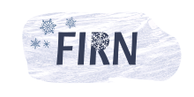

> :warning: This application is a work in progress.

    <i>A Nuxt3 web application for the <a href="https://ngisweden.scilifelab.se">National Genomics Infrastructure of Sweden</a>. It serves as laboratory inventory management system and a visualization layer for the data infrastructure.</i>

## Namesake

**Firn** refers to compacted, granular snow on mountain tops and glaciers that has survived at least one summer melt season. The word originates from Swiss-German "firn" meaning "of last year" and has been adopted into many languages, including [Swedish](https://www.saob.se/artikel/?unik=F_0443-0373.gEg6) and [English](https://www.britannica.com/science/firn).

This name was chosen for the application as it aptly reflects the cold storage conditions in the catalogued freezers and liquid nitrogen tanks. The meaning "of last year" also resonates with the application's role in managing items preserved over prolonged periods of time.

## Documentation

### Development

- [Typescript primer](docs/typescript.md)
- [Initial Setup](docs/development.md)
- [Debugging](docs/debugging.md)
- [Building the user interface](docs/ui.md)

### Guide to the application

#### Overview

- [Architecture overview](docs/architecture.md)
- [Libraries and dependencies](docs/libraries.md)

#### Data

- [Data handling](docs/data.md)
- [API Documentation](docs/api.md)
- [tRPC Setup](docs/trpc.md)

#### Users

- [Authentication and authorization](docs/auth.md)
- [Tokens](docs/tokens.md)

### Running the application

- [Deployment](docs/deployment.md)

## License

[MIT License](./LICENSE)
